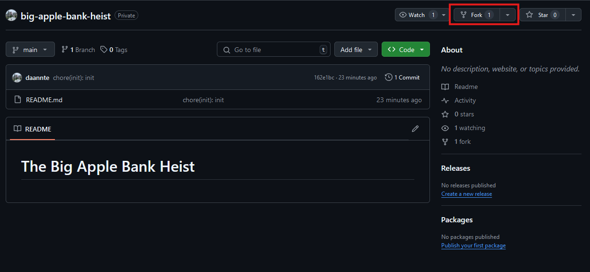

# The Big Apple Bank Heist

This repository contains the code for our project "The Big Apple Bank Heist" written in 6502 Assembly for the Commodore Vic-20. It's compiled using [DASM](https://github.com/dasm-assembler/dasm) and can be run on original hardware or via an emulator.

## Setup
1. Install make, DASM, and SCP

2. Create a fork of this repository

3. Clone your fork to your local machine

4. Create a .env file in the root of the repository containing the following variables:
    - USER=\<your UCalgary username\>
    - INFILE=\<name of the input assembly source file\>
    - OUTFILE=\<name of the output compiled program file\>
    - REMOTE=\<ssh remote to copy the program to\>

5. Run `make`
    - This will compile, upload, and run the program via the browser emulator provided by Dr. Aycock
    - You can also run any of the individual steps by doing `make [compile|upload|run]`
    - **NOTE** if running on Windows, use the Git Bash terminal